# Presentation

Tool to analyse dependencies of Maven and Gradle Projects.

Can:
- compare dependency list between multiple build configurations.
- gather latest version available from maven central repo https://mvnrepository.com
- gather attached CVEs from OSS Index https://ossindex.sonatype.org/
- parse dependency tree to ease browsing it

Developed in Python using Django Framework.

Known limitations:
- maven isn't thead safe ! If you have issues, try to execute task sequentially.
- depending on JAVA version used some Gradle older version won't work properly (cf https://docs.gradle.org/current/userguide/compatibility.html) 

# Start Guide

## How to run

### Locally

Fill or provide environment variables in `z_deps_scan/.env`

Make sure to install all necessary python package.

On project root directory launch:
```python manage.py createsuperuser```

To create/update database:
```./manage.py migrate```

Launch with:
```./manage.py runserver```

### With Docker

Fill `Docker.env` file.

Build Image, run it and create admin user
```
	docker build -t z_deps_scan .
    docker run -d -p 8000:8000 --name z_deps_scan z_deps_scan:latest
    docker exec -it z_deps_scan /bin/bash
    python manage.py createsuperuser
```

#### Some useful docker commands
```
docker ps -a
docker logs z_deps_scan
docker rm -f z_deps_scan
docker exec -it z_deps_scan /bin/bash
docker exec -it z_deps_scan python manage.py shell
```

## How to use

NB: no auto refresh, so you have to use the browser classic refresh button !

1. Login as admin in http://127.0.0.1:8000/admin

2. Add repo(s)
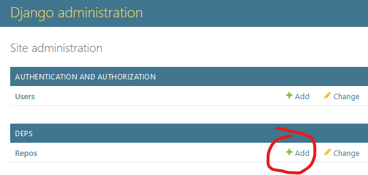
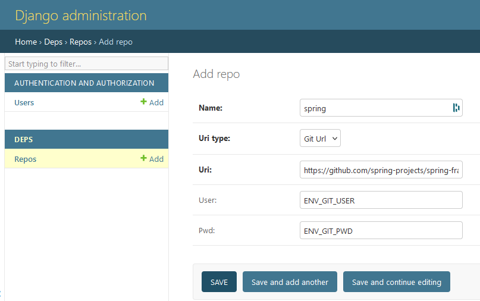

3. Go to http://127.0.0.1:8000/deps/Repo/list, and list branches ()
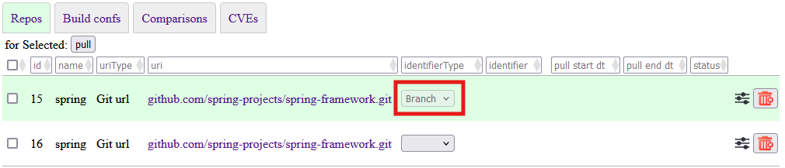

4. Select wanted branch
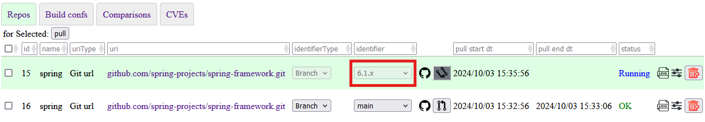

5. When pulling is done, go to detected build confs http://127.0.0.1:8000/deps/BuildConf/list
Here you can launch the dependencies list or dependency tree (risky to launch them in parallel !)
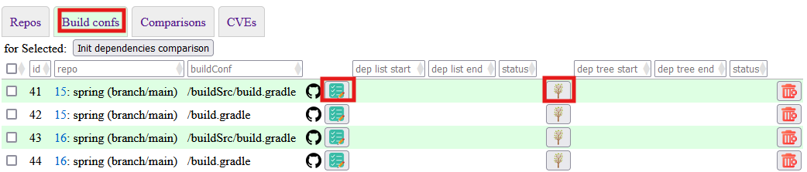

6. When finished you can view, Log , JSON result , or browser   clicking on corresponding icon

Ex for the dependency list view:
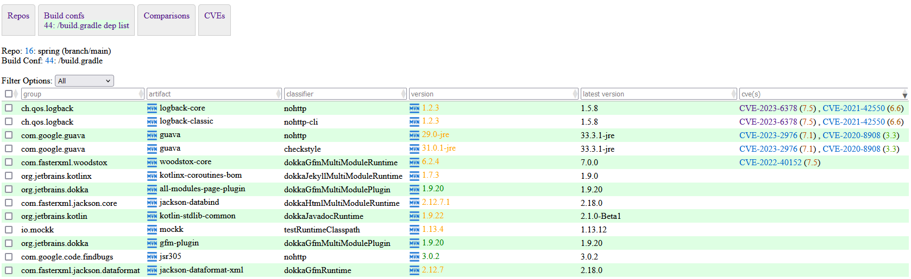

Ex for the dependency tree view:
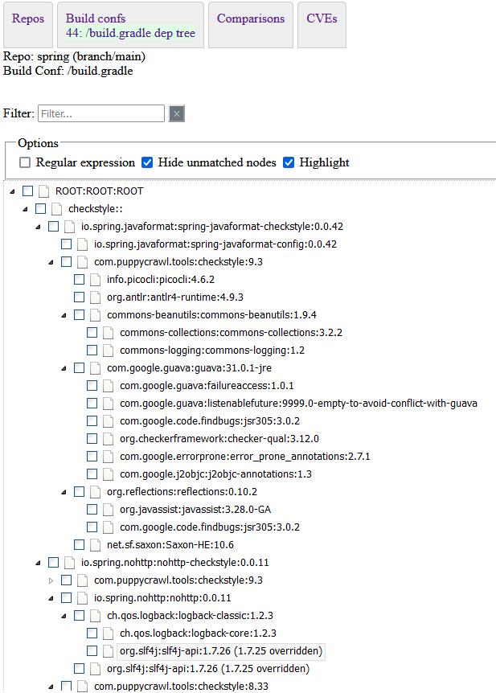

7. For a comparison, select the ones to compare (dependency list need to be done) and click `Init dependencies comparison`
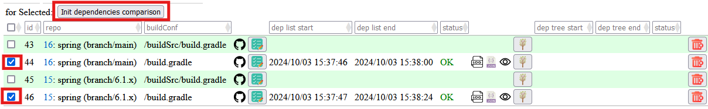

8. You should then be in http://127.0.0.1:8000/deps/BuildConfComparison/list/, and can click on `start`
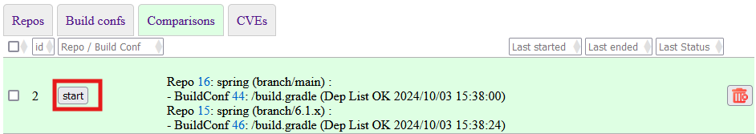

9. When finished you can view, JSON result , or browser   clicking on corresponding icon

Ex for the view:
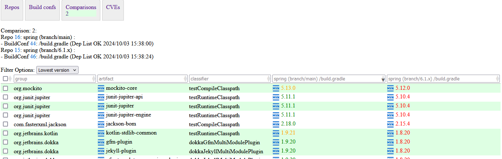

10. List all detected CVEs in http://127.0.0.1:8000/deps/Cve/list

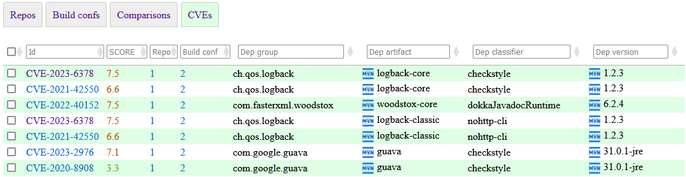

# Functionalities by url/page

/admin/login/ - Admin log in
/admin/logout/ - Admin log out

/admin :

- Add User
- Add Repo

/accounts/login/ - User log in
/accounts/logout/ - User log out

/deps/Repo/list:

- List Repo
- List Branch
- List Tag
- Pull

/deps/BuildConf/list:

- List BuildConfs (pom.xml, build.gradle)
- List dependencies:
    - check there latest available version
    - check attached CVEs using OSS index
- Get dependencies tree
- Select build confs to init comparison

/deps/BuildConf/<buildConf-id/dep_list/:

- for <buildconf-id> view dependencies list

  /deps/BuildConf/<buildConf-id/dep_tree/:
- for <buildconf-id> view dependencies tree

/deps/BuildConfComparison/list/:

- List Comparison
- Start Comparison

/deps/BuildConfComparison/<comparison-id>/result/view:

- for <comparison-id> view comparison result

# NBs

## Maven

Differences between dependency:tree and dependency:list

    Conflict Resolution and Mediation:
        dependency:tree shows the entire hierarchy and how conflicts are resolved (e.g., which version of a dependency is selected when there are multiple versions).
        dependency:list shows the final list of dependencies after conflict resolution, without the hierarchical context.

    Transitive Dependencies:
        dependency:tree explicitly shows transitive dependencies and their paths.
        dependency:list includes transitive dependencies but does not show how they are related.

    Scope:
        Both commands should consider the scope of dependencies (compile, test, runtime, etc.), but the tree view makes it clearer where each dependency comes from.
        If the scope or inclusion of dependencies is handled differently in configurations, the output may vary.

## Gradle

Gradle https://docs.gradle.org/current/userguide/viewing_debugging_dependencies.html
(n) - A dependency or dependency configuration that cannot be resolved
(c) - A dependency constraint, not a dependency. The dependency affected by the constraint occurs elsewhere in the tree.
(*) - Indicates repeated occurrences of a transitive dependency subtree. Gradle expands transitive dependency subtrees
only once per project; repeat occurrences only display the root of the subtree, followed by this annotation.

In Gradle, configurations can be mapped to existing classifiers in Maven projects to understand how dependencies are
categorized and resolved. Here’s a mapping of Gradle configurations to their typical counterparts in Maven projects:
Common Gradle Configurations and Their Maven Equivalents:

    compileClasspath:
        Gradle: Used to compile the main source set.
        Maven: Corresponds to the compile scope.
        Usage: compile dependencies in Maven are used at compile time and are included in the classpath for both compile and runtime.

    runtimeClasspath:
        Gradle: Used to run the main source set.
        Maven: Corresponds to the runtime scope.
        Usage: runtime dependencies in Maven are needed to run the application but not to compile it.

    compileOnly:
        Gradle: Dependencies required only for compiling the code but not at runtime.
        Maven: Corresponds to the provided scope.
        Usage: provided dependencies in Maven are available at compile time but are not packaged in the final artifact (e.g., Servlet API in a web application).

    runtimeOnly:
        Gradle: Dependencies required only at runtime.
        Maven: Corresponds to the runtime scope.
        Usage: Similar to runtimeClasspath but explicitly specifies dependencies not needed at compile time.

    testCompileClasspath:
        Gradle: Used to compile the test source set.
        Maven: Corresponds to the test scope.
        Usage: test dependencies in Maven are used only for compiling and running tests.

    testRuntimeClasspath:
        Gradle: Used to run the test source set.
        Maven: Corresponds to the test scope.
        Usage: Similar to testCompileClasspath but for runtime dependencies.

    implementation:
        Gradle: Includes dependencies required both at compile time and runtime, but keeps the dependency details encapsulated.
        Maven: Corresponds to the compile scope.
        Usage: Replaces the older compile configuration, promoting modularity and better dependency management.

    api:
        Gradle: Similar to implementation, but exposes the dependencies to consumers of the module.
        Maven: Corresponds to the compile scope with transitivity.
        Usage: Use when you want dependencies to be available to consumers of your library.

    annotationProcessor:
        Gradle: Dependencies required for annotation processing during compilation.
        Maven: Corresponds to the provided scope, but typically configured via the Maven Compiler Plugin.
        Usage: Used for tools like Lombok or custom annotation processors.

    compileOnlyApi:
        Gradle: Compile-only dependencies that should be exposed to consumers.
        Maven: Similar to the provided scope but for dependencies that need to be available to dependent projects.
        Usage: Less common, used when compile-only dependencies are needed in dependent projects.

## Gradle to Maven Scope Mapping:

   compileClasspath (Gradle) ↔ compile (Maven)
   runtimeClasspath (Gradle) ↔ runtime (Maven)
   compileOnly (Gradle) ↔ provided (Maven)
   runtimeOnly (Gradle) ↔ runtime (Maven)
   testCompileClasspath (Gradle) ↔ test (Maven)
   testRuntimeClasspath (Gradle) ↔ test (Maven)
   implementation (Gradle) ↔ compile (Maven)
   api (Gradle) ↔ compile (Maven) with transitivity
